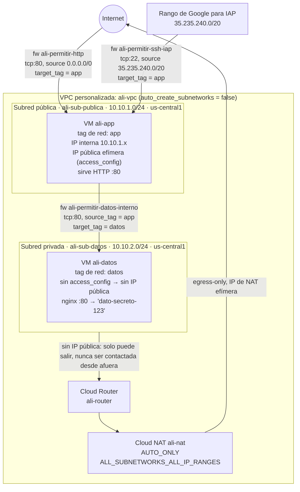
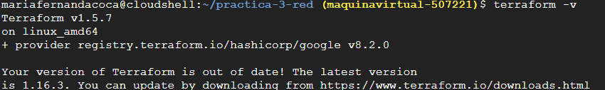
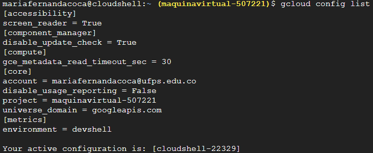
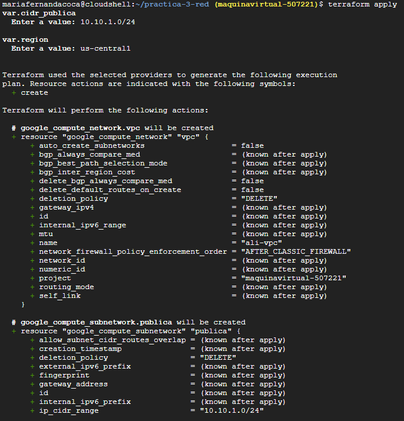
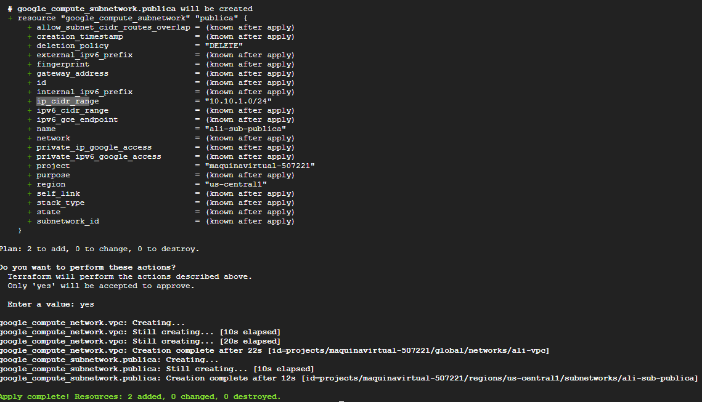
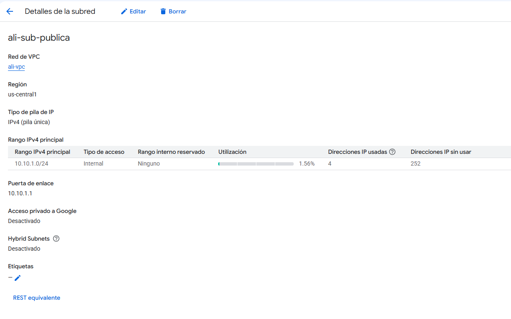
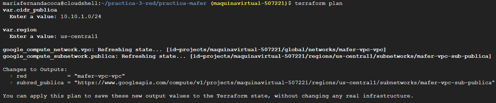
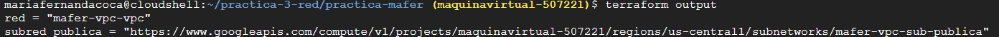
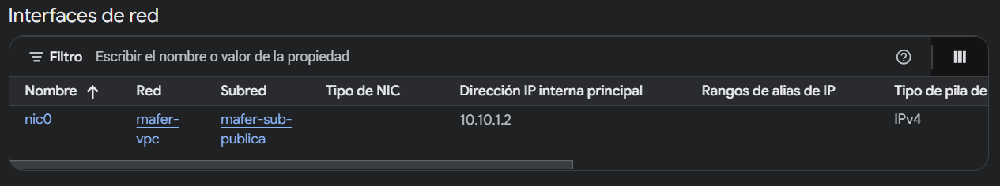
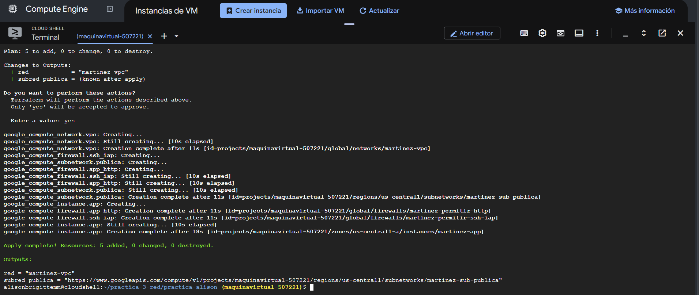

# Práctica 3 — Computación en la Nube (UFPS)

Informe de la Práctica 3, curso Computación en la Nube, profesor Daniel A. Esteban.

## 1. Identificación

- **Equipo:** Grupo 6
- **Integrantes:** 
Alison Brigitte Martinez Machado - 1152299
Maria Fernanda Corzo Castro - 1152300
Juan Camilo Uribe Mendoza  - 1152326

- **Proyecto de Google Cloud:** `maquinavirtual-507221`

### Cómo trabajamos

Los tres integrantes compartimos el mismo proyecto de Google Cloud, pero cada uno desplegó la práctica completa en su propia carpeta del repositorio, con su propia infraestructura (VPC, subredes, instancias y reglas de cortafuegos propias) y con un prefijo distinto en los nombres de los recursos (`mafer`, `martinez`, `ali`) para que no chocaran entre sí. Por eso las capturas de evidencia muestran prefijos y usuarios de Cloud Shell distintos según la fase: no es un error, es el resultado de trabajar los tres en paralelo sobre el mismo proyecto.

La carpeta [practica-mafer/](practica-mafer/) contiene la infraestructura de María Fernanda (prefijo `mafer`), [practica-alison/](practica-alison/) la de Alison Brigitte (prefijo `martinez`), y los archivos en la raíz del repositorio ([main.tf](main.tf), [outputs.tf](outputs.tf), [variables.tf](variables.tf)) corresponden a la infraestructura con prefijo `ali`, usada para el reto de la fase 6 por parte de Juan Camilo.

Nos repartimos la redacción de las evidencias así: Juan Camilo se encargó de las evidencias 0 y 1, María Fernanda de las evidencias 2 y 3, Alison Brigitte de las evidencias 4 y 5, y la evidencia 6 corresponde a la infraestructura con prefijo `ali` evidencia por Juan Camilo.

## 2. Diagrama de la infraestructura

Diagrama construido a partir del código en [main.tf](main.tf) (infraestructura con prefijo `ali`, la que se usó para el reto de la fase 6 y que incluye la red completa: dos subredes, dos máquinas, NAT y las tres reglas de cortafuegos).



- **Entrada pública:** internet llega a `ali-app` por el puerto 80 (regla `ali-permitir-http`, origen `0.0.0.0/0`, aplica solo a la etiqueta `app`).
- **Entrada administrativa:** el SSH por IAP llega también a `ali-app` por el puerto 22, pero solo desde el rango fijo `35.235.240.0/20` (el rango desde el que Google reenvía el tráfico de IAP), regla `ali-permitir-ssh-iap`.
- **Tráfico interno:** `ali-app` consulta a `ali-datos` por HTTP puerto 80; la regla `ali-permitir-datos-interno` solo permite ese tráfico si el origen tiene la etiqueta `app` y el destino la etiqueta `datos` — nada más en la VPC puede llegar a `ali-datos`.
- **Salida privada:** `ali-datos` no tiene `access_config`, así que no tiene IP pública ni es alcanzable desde afuera. Para poder instalar paquetes, su tráfico de salida pasa por el Cloud Router `ali-router` y el Cloud NAT `ali-nat`, que le da una IP pública efímera solo para egress.

## 3. Evidencias

### Fase 0 – Preparación

Se verifica que Terraform está instalado en Cloud Shell y que la sesión de `gcloud` apunta a la cuenta y al proyecto correctos del equipo (`maquinavirtual-507221`).




```
$ terraform -v
Terraform v1.5.7
on linux_amd64
+ provider registry.terraform.io/hashicorp/google v8.2.0

$ gcloud config list
[core]
account = mariafernandacoca@ufps.edu.co
project = maquinavirtual-507221
Your active configuration is: [cloudshell-22329]
```

### Fase 1 – La red y su subred

Se demuestra la creación de la VPC en modo personalizado (`auto_create_subnetworks = false`) y de su subred pública mediante `terraform apply`, y se inspecciona el detalle de la subred ya creada en la consola de Google Cloud.





```
$ terraform apply
var.cidr_publica
  Enter a value: 10.10.1.0/24
var.region
  Enter a value: us-central1

  # google_compute_network.vpc will be created
      + name = "mafer-vpc-vpc"
  # google_compute_subnetwork.publica will be created
      + name = "mafer-vpc-sub-publica"

Plan: 2 to add, 0 to change, 0 to destroy.
Enter a value: yes

google_compute_network.vpc: Creation complete after 22s [id=.../networks/mafer-vpc-vpc]
google_compute_subnetwork.publica: Creation complete after 11s [id=.../subnetworks/mafer-vpc-sub-publica]

Apply complete! Resources: 2 added, 0 changed, 0 destroyed.
```

En esa salida la red aparece como `mafer-vpc-vpc` porque en ese momento la variable `prefijo` en `terraform.tfvars` estaba puesta como `"mafer-vpc"`, y el código en `main.tf` ya le agrega el sufijo `-vpc` (`"${var.prefijo}-vpc"`). Luego corregimos el prefijo a `"mafer"`, y desde entonces la red quedó como `mafer-vpc`, que es el nombre que se ve en `gcloud compute networks list` en la fase 5.

Detalle de la subred pública consultado en la consola (evidencia de otra de las infraestructuras del equipo, prefijo `ali`):

| Rango IPv4 principal | Tipo de acceso | Utilización | Direcciones usadas | Direcciones sin usar |
|---|---|---|---|---|
| 10.10.1.0/24 | Internal | 1.56 % | 4 | 252 |

Las 4 direcciones usadas son las que Google Cloud reserva siempre en toda subred (dirección de red, puerta de enlace, penúltima y broadcast); por eso la utilización no es 0 % aunque todavía no hubiera máquinas en la subred.

### Fase 2 – Variables y salidas

Se demuestra que, tras refactorizar el código para leer valores desde variables en vez de tenerlos escritos a mano, `terraform plan` no propone ningún cambio sobre la infraestructura real: solo hay cambios en las salidas (`outputs`), que es el resultado esperado de un refactor que no toca el valor final de ningún recurso.




```
$ terraform plan
var.cidr_publica
  Enter a value: 10.10.1.0/24
var.region
  Enter a value: us-central1

google_compute_network.vpc: Refreshing state... [id=.../networks/mafer-vpc-vpc]
google_compute_subnetwork.publica: Refreshing state... [id=.../subnetworks/mafer-vpc-sub-publica]

Changes to Outputs:
  + red            = "mafer-vpc-vpc"
  + subred_publica = "https://www.googleapis.com/compute/v1/projects/maquinavirtual-507221/regions/us-central1/subnetworks/mafer-vpc-sub-publica"

You can apply this plan to save these new output values to the Terraform state, without changing any real infrastructure.

$ terraform output
red = "mafer-vpc-vpc"
subred_publica = "https://www.googleapis.com/compute/v1/projects/maquinavirtual-507221/regions/us-central1/subnetworks/mafer-vpc-sub-publica"
```

### Fase 3 – La aplicación

Se demuestra la máquina de aplicación desplegada dentro de la subred del equipo (no en la red `default`), tomando su IP interna de ese rango.



[FALTA: no se recibió una salida de terminal específica para esta fase; solo se cuenta con la captura de la interfaz de red de la instancia.]

### Fase 4 – Las puertas

Esta sección debe demostrar: (1) la aplicación abierta desde un dispositivo fuera del campus, con la IP visible en la barra de direcciones; (2) la tabla de reglas de cortafuegos de la VPC con sus orígenes y etiquetas de destino; y (3) una sesión SSH abierta por IAP.

Sesiones SSH por IAP registradas para esta fase:

```
$ gcloud compute ssh mafer-app --tunnel-through-iap --zone=us-central1-a
Warning: Permanently added 'compute.8441460388800960637' (ED25519) to the list of known hosts.
Linux mafer-app 6.1.0-53-cloud-amd64 #1 SMP PREEMPT_DYNAMIC Debian 6.1.187-1 (2026-09-07) x86_64
```

```
$ gcloud compute ssh martinez-app --tunnel-through-iap
Did you mean zone [us-east1-b] for instance: [martinez-app] (Y/n)?  n
No zone specified. Using zone [us-central1-a] for instance: [martinez-app].
Updating project ssh metadata...done.
Waiting for SSH key to propagate.
Warning: Permanently added 'compute.9170049015872700898' (ED25519) to the list of known hosts.
Linux martinez-app 6.1.0-53-cloud-amd64 #1 SMP PREEMPT_DYNAMIC Debian 6.1.187-1 (2026-09-07) x86_64
alisonbrigittemm@martinez-app:~$
```

### Fase 5 – Reproducir desde cero

Se demuestra que la infraestructura se puede destruir por completo y reconstruir desde cero solo con el código: `terraform destroy` elimina todos los recursos administrados y `terraform apply` los vuelve a crear con los mismos nombres y la misma configuración.




```
$ terraform destroy
- red            = "martinez-vpc" -> null
- subred_publica = "...subnetworks/martinez-sub-publica" -> null
Enter a value: yes

google_compute_firewall.app_http: Destruction complete after 11s
google_compute_firewall.ssh_iap: Destruction complete after 11s
google_compute_instance.app: Destruction complete after 21s
google_compute_subnetwork.publica: Destruction complete after 11s
google_compute_network.vpc: Destruction complete after 31s

Destroy complete! Resources: 5 destroyed.

$ gcloud compute instances list
NAME: mafer-app
ZONE: us-central1-a
MACHINE_TYPE: e2-micro
INTERNAL_IP: 10.10.1.2
```

```
$ terraform apply
Plan: 5 to add, 0 to change, 0 to destroy.
Enter a value: yes

google_compute_network.vpc: Creation complete after 11s [id=.../networks/martinez-vpc]
google_compute_subnetwork.publica: Creation complete after 11s
google_compute_firewall.app_http: Creation complete after 11s
google_compute_firewall.ssh_iap: Creation complete after 11s
google_compute_instance.app: Creation complete after 18s [id=.../instances/martinez-app]

Apply complete! Resources: 5 added, 0 changed, 0 destroyed.

Outputs:
red = "martinez-vpc"
subred_publica = "https://www.googleapis.com/compute/v1/projects/maquinavirtual-507221/regions/us-central1/subnetworks/martinez-sub-publica"

$ gcloud compute networks list
NAME: ali-vpc
NAME: default
NAME: mafer-vpc
```

El orden en el que `terraform destroy` borra los recursos (primero las reglas de cortafuegos y la instancia, al final la subred y la red) no es arbitrario: Terraform recorre el grafo de dependencias que construyó a partir de las referencias del código (la instancia depende de la subred, la subred depende de la red, las reglas dependen de la red) y lo destruye en el orden inverso al de creación, para no intentar borrar un recurso del que todavía depende otro.

En `gcloud compute instances list` y `gcloud compute networks list` siguen apareciendo `mafer-app`, `ali-vpc` y `mafer-vpc`: no son restos de la infraestructura destruida, sino las instancias y redes propias de las otras integrantes del equipo, que comparten el mismo proyecto pero viven en sus propias carpetas y son completamente independientes de la que se destruyó y reconstruyó aquí. También se observa que la IP pública de la máquina reconstruida cambia respecto a la que tenía antes del destroy, porque es una IP efímera: Google Cloud no garantiza reasignar la misma.

### Fase 6 – La máquina que nadie puede alcanzar

Se demuestra que la máquina de datos, sin IP pública, es inalcanzable desde fuera de la VPC pero sí responde por su IP interna a quien esté dentro de la red (en este caso, entrando primero por SSH a la máquina de aplicación).


**(a) La página de la aplicación, con el dato que viene de la máquina privada:**


**(b) Desde fuera de la subred privada, el acceso directo a la máquina de datos agota el tiempo de espera:**


```
$ terraform apply
google_compute_instance.app: Destruction complete after 21s
google_compute_instance.app: Creation complete after 18s [id=.../instances/ali-app]
Apply complete! Resources: 1 added, 0 changed, 1 destroyed.

Outputs:
ip_interna_datos = "10.10.2.2"
ip_publica_app   = "35.224.249.255"
red              = "ali-vpc"
subred_publica   = ".../subnetworks/ali-sub-publica"

$ curl -m 8 http://35.224.249.255
<h1>ali - juancamiloum</h1>
<p>Servidor de aplicación. IP interna: 10.10.1.3</p>
<p>Dato desde la máquina privada: dato-secreto-123</p>

$ curl -m 8 http://10.10.2.2
curl: (28) Connection timed out after 8002 milliseconds
```

El `curl` directo a `10.10.2.2` desde Cloud Shell (fuera de la VPC del equipo) agota el tiempo: el paquete se descarta porque esa IP no tiene ruta pública ni la máquina tiene IP externa a la cual responder.

**(c) Desde dentro, por SSH con IAP hasta la máquina de aplicación, sí se alcanza la máquina de datos por su IP interna:**


```
$ gcloud compute ssh ali-app --zone=us-central1-a --tunnel-through-iap
Linux ali-app 6.1.0-53-cloud-amd64 #1 SMP PREEMPT_DYNAMIC Debian 6.1.187-1 (2026-09-07) x86_64

juancamiloum@ali-app:~$ curl -m 8 http://10.10.2.2
dato-secreto-123
juancamiloum@ali-app:~$ exit
```

No se cuenta con una captura de `gcloud compute instances list` para esta fase que muestre la columna `EXTERNAL_IP` vacía de la máquina de datos, así que ese punto queda pendiente de evidencia [FALTA: captura de `gcloud compute instances list` para la infraestructura con prefijo `ali`].

## 4. Comandos ejecutados

### Fase 0 – Preparación

```bash
terraform -v
gcloud config list
```

[FALTA: no se recibió el comando exacto de instalación de Terraform, ni `gcloud services enable`, ni los comandos de `git clone`/`git pull` usados para esta fase.]

### Fase 1 – La red y su subred

```bash
terraform apply
# var.cidr_publica -> 10.10.1.0/24
# var.region       -> us-central1
```

### Fase 2 – Variables y salidas

```bash
terraform plan
terraform output
```

### Fase 4 – Las puertas

```bash
gcloud compute ssh mafer-app --tunnel-through-iap --zone=us-central1-a
gcloud compute ssh martinez-app --tunnel-through-iap
```

### Fase 5 – Reproducir desde cero

```bash
terraform destroy
gcloud compute instances list
terraform apply
gcloud compute networks list
```

### Fase 6 – La máquina que nadie puede alcanzar

```bash
terraform apply
terraform output
curl -m 8 http://35.224.249.255
curl -m 8 http://10.10.2.2
gcloud compute ssh ali-app --zone=us-central1-a --tunnel-through-iap
curl -m 8 http://10.10.2.2   # ejecutado dentro de ali-app, por SSH
```

### Verificación del repositorio

```bash
git ls-files
```

## 5. Decisiones libres

**Qué desplegamos en la máquina de datos.** Un servidor nginx sirviendo un archivo estático con el texto `dato-secreto-123`, en el puerto 80 (el mismo puerto que abre la regla de cortafuegos interna `permitir-datos-interno`). Lo elegimos por ser lo más simple que demuestra una máquina que responde por HTTP, y porque reutiliza el mismo servidor (nginx) que ya usa la máquina de aplicación. Con una base de datos real, la regla interna habría tenido que abrir otro puerto (el del motor de base de datos) y el script de arranque de la app habría necesitado un cliente de base de datos en vez de un simple `curl`.

**Organización de los archivos `.tf`.** En la raíz del repositorio usamos un solo `main.tf` porque Terraform concatena todos los archivos `.tf` de un mismo directorio como si fueran uno solo, así que separarlos no cambia el comportamiento, solo la organización; lo haríamos si el proyecto fuera de mayor tamaño y complejidad. En la carpeta `practica-mafer/` sí separamos el reto en un archivo aparte, [reto.tf](practica-mafer/reto.tf), dejando la infraestructura base en [main.tf](practica-mafer/main.tf): ahí sí valió la pena dividir, porque el reto agrega un bloque de recursos nuevo y claramente distinguible (subred privada, router, NAT, máquina de datos y su regla) sobre una base que ya estaba terminada y evaluada, y separarlos hace más fácil ver qué es la práctica base y qué es la extensión.

**Administración de la máquina sin IP pública.** Entramos por SSH (a través de IAP) a la máquina de aplicación, y desde ahí llegamos a la máquina de datos por su IP interna, como se ve en la fase 6: la app funciona como salto (bastión). Esto permite ejecutar comandos contra la máquina de datos sin exponerla nunca a internet, pero depende de que la máquina de aplicación esté disponible. Una alternativa igual de válida es el SSH directo por IAP a la máquina de datos, agregando su etiqueta (`datos`) al `target_tags` de la regla `permitir-ssh-iap`; tampoco requiere IP pública, porque IAP no necesita que la VM de destino tenga una.

**Direccionamiento de las dos subredes.** Usamos `10.10.1.0/24` para la subred pública y `10.10.2.0/24` para la privada. Son rangos privados (RFC 1918), no se solapan entre sí y comparten el bloque `10.10.0.0/16`, de modo que el tercer octeto identifica el propósito de cada subred (1 = pública, 2 = privada). Si en el futuro hubiera que conectar esta red con otra, por peering o VPN, la otra red tendría que usar un bloque distinto (por ejemplo `10.20.0.0/16`), porque dos redes con rangos solapados no se pueden conectar.

## 6. Preguntas

**Si le quitas la etiqueta de red a la máquina de aplicación y aplicas, ¿qué deja de funcionar exactamente, y por qué la regla de cortafuegos sigue existiendo?**

Qué deja de funcionar: todo lo que dependía de esa etiqueta, La instancia queda aislada pero sigue existiendo y con IP pública, pero el cortafuegos descarta todo en silencio porque ninguna regla la reconoce ya.

La regla sigue existiendo porque son recursos independientes. La regla no depende de la instancia, solo evalúa. Quitarle la etiqueta a la instancia no borra la regla, solo hace que deje de aplicarle.

**¿Por qué el plan de la fase 2 no propuso ningún cambio, si el código era distinto? ¿Qué habrías tenido que cambiar para que sí propusiera recrear un recurso?**

Terraform compara los valores finales ya resueltos de cada recurso contra lo que guardó en el estado, no el texto del código. Sustituir un valor que estaba escrito a mano por una variable que termina resolviendo exactamente al mismo valor produce la misma configuración final, así que no hay nada que cambiar en la infraestructura real; por eso el `plan` solo mostró cambios en las salidas (`outputs`), que sí se recalculan porque antes no existían como tales. Para forzar una recreación real haría falta cambiar un atributo que el proveedor de Google no puede modificar en caliente sobre un recurso ya creado, por ejemplo el `name` o la `region` de la subred, `auto_create_subnetworks` de la VPC, o la zona o la imagen del disco de arranque de una instancia. En esos casos el plan lo marca explícitamente como `# forces replacement` o `must be replaced`.

**Con la red completa encendida, ¿cuánto costaría un mes? Desglosa por recurso y señala cuál es el que más sorprende.?**

Con la red encendida durante un mes en us-central1, el costo estimado es de USD 7.11. La VPC, subredes, reglas de firewall e IAP son gratuitos. El mayor costo corresponde a la e2-micro (USD 6.11) y el disco de 10 GB (USD 1.00). Lo más sorprendente es que la IP pública puede costar más de la mitad que la propia máquina, a pesar de ser solo una dirección. Además, esta cifra no considera la capa gratuita de la e2-micro, que podría reducir el costo, aunque la IP externa no está incluida en ella.

## Verificación del estado

```
$ git ls-files
.gitignore
README.md
arranque-datos.sh
arranque.sh
main.tf
outputs.tf
variables.tf
terraform.tfvars
Evidencia/...
practica-alison/main.tf
practica-alison/outputs.tf
practica-alison/variables.tf
practica-alison/terraform.tfvars
practica-alison/arranque.sh
practica-alison/.gitignore
practica-mafer/main.tf
practica-mafer/reto.tf
practica-mafer/outputs.tf
practica-mafer/variables.tf
practica-mafer/terraform.tfvars
practica-mafer/arranque.sh
practica-mafer/datos.sh
practica-mafer/.terraform.lock.hcl
practica-mafer/.gitignore
```

Con `git ls-files` comprobamos que ningún archivo `.tfstate` ni la carpeta `.terraform/` llegaron al repositorio (están excluidos en [.gitignore](.gitignore)), y que `.terraform.lock.hcl` sí quedó versionado a propósito en `practica-mafer/`, para fijar la versión exacta del proveedor de Google usada y que el `terraform init` de cualquier integrante instale siempre la misma.

El estado de Terraform no debe ser público porque describe la infraestructura real tal como quedó desplegada —nombres, IDs, IPs internas y externas, relaciones entre recursos— y puede llegar a contener valores sensibles (como credenciales o metadatos) que un atacante podría usar para entender o atacar la infraestructura sin siquiera tener acceso al proyecto de Google Cloud.
